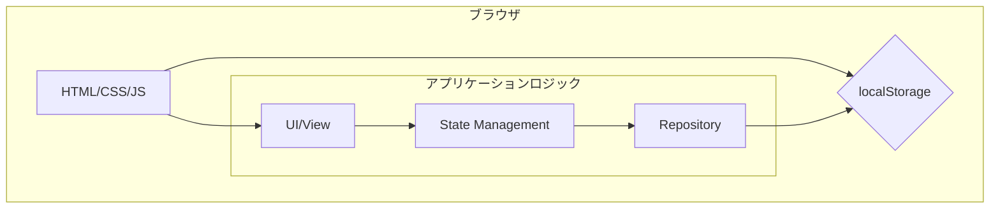

# 基本設計書 - タスク管理アプリ

## 1. 概要

本ドキュメントは、[要件定義書.md](./要件定義書.md)に基づき、タスク管理Webアプリケーションの基本設計を定義する。

- **目的**: 要件定義からリリースまでの一連の開発プロセスを体験するための教材。ならびに、個人の生産性向上を支援するツール。
- **対象**: フロントエンドのみで動作するシングルページアプリケーション（SPA）。

## 2. システム構成

本アプリは、外部サーバーを必要としない完全にクライアントサイドで完結する構成を取る。

- **実行環境**: モダンブラウザ (Chrome, Edge, Firefox, Safari)
- **使用技術**: HTML, CSS, Vanilla JavaScript (ES6+)
- **データストア**: ブラウザの `localStorage`
- **外部ライブラリ**: 原則として使用しない



## 3. 画面設計

単一画面構成とし、主要なエリアを「ヘッダー」「メインコンテンツ」「フッター」に分割する。

### 3.1. 画面レイアウト

```
+------------------------------------------------------+
| ヘッダー                                             |
|   - アプリタイトル: "タスク管理"                     |
|   - タスクカウンタ: (未着手: X / 進行中: Y / 完了: Z)  |
+------------------------------------------------------+
| メインコンテンツ                                     |
|                                                      |
|   [新規タスク登録フォーム]                           |
|   - タイトル*, 期限, タグ                            |
|   - [追加]ボタン                                     |
|                                                      |
|   [制御エリア]                                       |
|   - フィルタ (キーワード, タグ, 期限, ステータス)    |
|   - ソート (作成日, 期限, タイトル)                  |
|                                                      |
|   [タスク一覧テーブル]                               |
|   | | タイトル | ステータス | 期限 | タグ | 操作 |
|   |☑| Task A  | 完了     | ...  | ...  | ✏️ 🗑️ |
|   |☐| Task B  | 未着手   | ...  | ...  | ✏️ 🗑️ |
|                                                      |
+------------------------------------------------------+
| フッター                                             |
|   - CSVエクスポートボタン                            |
|   - Copyright表示                                    |
+------------------------------------------------------+
```

### 3.2. UIコンポーネント詳細

- **新規登録フォーム**:
  - タイトル: `<input type="text" required>`
  - 期限: `<input type="date">`
  - タグ: `<input type="text" placeholder="カンマ区切りで入力">`
  - 操作: Enterキーでタスク追加、Escキーでフォーム内容をクリア。
- **タスク一覧**:
  - テーブル(`<table>`)形式で表示。
  - **完了トグル**: 各行の先頭にチェックボックス(`<td><input type="checkbox"></td>`)を配置。
  - **ステータス**: 色分けされたバッジで表示（例: `<span>`タグにクラスを付与）。
  - **期限**: 色分けされたバッジで表示（赤: 期限切れ, 青: 本日, 緑: 未来）。
  - **完了タスク**: タイトルに打ち消し線 (`text-decoration: line-through`) を適用。
  - **操作**: 「編集」「削除」ボタンを各行に配置。
- **編集UI**:
  - 「編集」ボタンクリック時に、モーダルダイアログを表示して編集フォームを提供する。
- **フィードバック**:
  - 保存、削除、エラー発生時に、画面上部にトーストメッセージを数秒間表示する。

## 4. 機能設計

### 4.1. タスク管理機能 (CRUD)

- **UC-01: 新規登録**:
  1. ユーザーがフォームに入力し、「追加」ボタンまたはEnterキーを押下。
  2. 入力値のバリデーション（タイトルが空でないこと）を実行。
  3. 新規タスクオブジェクトを生成（`id`, `created_at`, `updated_at`を付与）。
  4. `repository.js`経由で`localStorage`に保存。
  5. タスク一覧を再描画。
- **UC-02: 編集**:
  1. 「編集」ボタンクリックで、対象タスクのデータが入力されたモーダルを表示。
  2. ユーザーが内容を変更し、「更新」ボタンを押下。
  3. `updated_at`を現在時刻で更新。
  4. `localStorage`の該当データを更新。
  5. タスク一覧を再描画。
- **UC-03: 完了/未完トグル**:
  1. チェックボックスの状態変更を検知。
  2. 対象タスクの`status`を`done` ⇔ `todo`で切り替え。
  3. `updated_at`を更新し、`localStorage`に保存。
  4. 対象行のスタイル（打ち消し線）とカウンタを更新。
- **UC-04: 削除**:
  1. 「削除」ボタンクリックで、`window.confirm()`による確認ダイアログを表示。
  2. OKの場合、`localStorage`から該当データを削除。
  3. タスク一覧を再描画。

### 4.2. 一覧制御機能

- **UC-05: フィルタ**:
  1. 各フィルタコントロール（テキスト入力、セレクトボックス等）の変更を検知。
  2. 現在の全フィルタ条件を取得。
  3. `localStorage`から全タスクを読み込み、フィルタ条件に合致するものだけを抽出。
  4. 抽出されたタスクで一覧を再描画。
- **UC-06: ソート**:
  1. ソート用ドロップダウンの変更を検知。
  2. 現在表示されている（フィルタ適用後の）タスク配列を、指定された条件でソート。
  3. ソート後のタスクで一覧を再描画。

### 4.3. データ連携機能

- **UC-07: CSVエクスポート**:
  1. 「エクスポート」ボタンをクリック。
  2. `localStorage`から全タスクデータを取得。
  3. `DR-04`で定義されたカラム順のCSV文字列を生成（`
`区切り）。
  4. 生成した文字列から`Blob`オブジェクトを作成（`type: 'text/csv;charset=utf-8;'`）。
  5. `URL.createObjectURL`でURLを生成し、`<a>`タグの`href`に設定。`download`属性にファイル名を指定し、プログラムからクリックしてダウンロードを実行。

## 5. データ設計

要件定義書`DR`セクションを踏襲する。

- **保管先**: `localStorage`
- **キー名**: `todo_tasks_v1`
- **スキーマ (JSON)**:
  ```json
  [
    {
      "id": "string",       // UUID v4
      "title": "string",      // 必須
      "due": "string | null", // YYYY-MM-DD
      "tags": "string[]",
      "status": "'todo' | 'doing' | 'done'",
      "created_at": "string", // ISO8601
      "updated_at": "string"  // ISO8601
    }
  ]
  ```
- **ID生成**: `self.crypto.randomUUID()` を使用して一意性を担保する。

## 6. モジュール設計

保守性と将来の拡張性を考慮し、責務に基づいてJavaScriptファイルを分割する。

- **`main.js`**:
  - **責務**: アプリケーションのエントリーポイント。
  - **役割**: 各モジュールのインスタンス化、イベントリスナーの初期登録、アプリケーション全体の起動処理。
- **`view.js`**:
  - **責務**: DOM操作とUIの更新。
  - **役割**: タスク一覧の描画、フォームのリセット、カウンタの更新、モーダルの表示/非表示など、状態に応じた画面の更新を担当。状態は保持しない。
- **`store.js`**:
  - **責務**: アプリケーションの状態管理。
  - **役割**: タスクの配列、フィルタ条件、ソート条件といった状態を保持・管理する。`repository.js`から取得したデータを加工して保持する。
- **`repository.js`**:
  - **責務**: データ永続化層とのインターフェース。
  - **役割**: `localStorage`に対するCRUD（作成、読み取り、更新、削除）処理をカプセル化する。これにより、将来的にデータストアを別のもの（例: バックエンドAPI）に差し替える際の変更箇所をこのファイルに限定できる。
- **`utils.js`**:
  - **責務**: 汎用的なヘルパー関数。
  - **役割**: 日付のフォーマット、CSV文字列の生成、入力バリデーションなど、特定のモジュールに依存しない純粋な関数を提供する。

## 7. 非機能要件設計

- **パフォーマンス (NFR-01)**:
  - DOM操作の最適化: タスク一覧の再描画は、差分更新ではなく全件再描画とする（500件程度なら許容範囲と判断）。ただし、不要な再描画は避ける。
  - イベント委譲: タスク一覧の各行へのイベントリスナーは、親要素である`<tbody>`に一つだけ登録し、イベントの発生源を特定する方式（イベントデリゲーション）を採用する。
- **アクセシビリティ (NFR-06, UI-02)**:
  - セマンティックHTML: `<header>`, `<main>`, `<footer>`, `<nav>`, `<button>`などを適切に使用。
  - ラベル付け: 全てのフォーム要素に`<label>`を関連付ける。
  - フォーカス管理: モーダル表示時は、フォーカスをモーダル内にトラップする。キーボード（Tabキー）での操作性を確保する。
- **セキュリティ (NFR-04)**:
  - XSS対策: ユーザー入力をDOMに反映させる際は、原則として`textContent`を使用する。`innerHTML`の使用は避ける。
