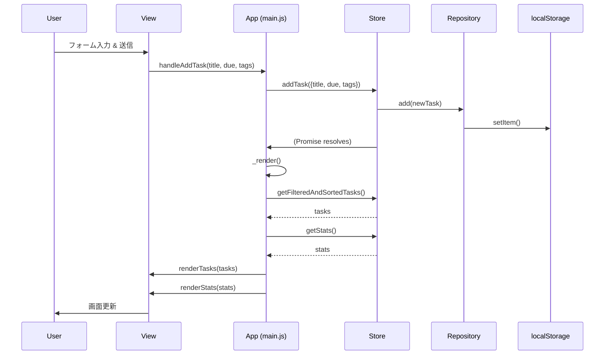
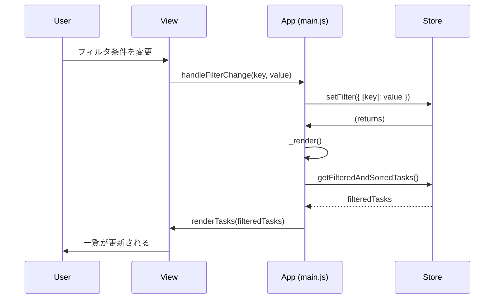

# 詳細設計書 - タスク管理アプリ

## 1. 概要

本ドキュメントは[基本設計書](./基本設計.md)に基づき、各モジュールの具体的な実装方法、クラス・関数仕様、データ構造、およびモジュール間の連携について詳細に定義する。

## 2. HTML構造設計 (`index.html`)

主要なDOM要素にIDを割り振り、JavaScriptからのアクセスを容易にする。

```html
<!DOCTYPE html>
<html lang="ja">
<head>
    <meta charset="UTF-8">
    <meta name="viewport" content="width=device-width, initial-scale=1.0">
    <title>タスク管理アプリ</title>
    <link rel="stylesheet" href="style.css">
</head>
<body>

    <header>
        <h1>タスク管理</h1>
        <div id="task-stats">未着手: 0 / 進行中: 0 / 完了: 0</div>
    </header>

    <main>
        <!-- 新規登録フォーム -->
        <section id="add-task-section">
            <form id="add-task-form">
                <input type="text" id="new-task-title" placeholder="タスクのタイトルを入力" required>
                <input type="date" id="new-task-due">
                <input type="text" id="new-task-tags" placeholder="タグ (カンマ区切り)">
                <button type="submit">追加</button>
            </form>
        </section>

        <!-- 制御エリア -->
        <section id="control-section">
            <input type="search" id="filter-keyword" placeholder="キーワードで検索">
            <input type="text" id="filter-tag" placeholder="タグで検索">
            <select id="filter-status">
                <option value="all">すべてのステータス</option>
                <option value="todo">未着手</option>
                <option value="doing">進行中</option>
                <option value="done">完了</option>
            </select>
            <select id="sort-by">
                <option value="created_at_desc">作成日(新しい順)</option>
                <option value="created_at_asc">作成日(古い順)</option>
                <option value="due_asc">期限(昇順)</option>
                <option value="title_asc">タイトル(A-Z)</option>
            </select>
            <button id="clear-filters-btn">フィルタクリア</button>
        </section>

        <!-- タスク一覧 -->
        <section id="task-list-section">
            <table id="task-table">
                <thead>
                    <tr>
                        <th>完了</th>
                        <th>タイトル</th>
                        <th>ステータス</th>
                        <th>期限</th>
                        <th>タグ</th>
                        <th>作成日時</th>
                        <th>操作</th>
                    </tr>
                </thead>
                <tbody id="task-list-body">
                    <!-- タスク行はJSで動的に生成 -->
                </tbody>
            </table>
        </section>

        <!-- 編集モーダル (初期状態は非表示) -->
        <div id="edit-modal" class="modal" style="display:none;">
            <div class="modal-content">
                <span class="close-btn">&times;</span>
                <form id="edit-task-form">
                    <input type="hidden" id="edit-task-id">
                    <input type="text" id="edit-task-title" required>
                    <input type="date" id="edit-task-due">
                    <input type="text" id="edit-task-tags">
                    <select id="edit-task-status">
                        <option value="todo">未着手</option>
                        <option value="doing">進行中</option>
                        <option value="done">完了</option>
                    </select>
                    <button type="submit">更新</button>
                </form>
            </div>
        </div>

    </main>

    <footer>
        <button id="export-csv-btn">CSVエクスポート</button>
        <p>&copy; 2025 Your Name</p>
    </footer>

    <div id="toast-container"></div>

    <script src="utils.js"></script>
    <script src="repository.js"></script>
    <script src="store.js"></script>
    <script src="view.js"></script>
    <script src="main.js"></script>
</body>
</html>
```

## 3. CSS設計 (`style.css`)

- **基本方針**: BEM（Block, Element, Modifier）を参考にしつつ、シンプルさを保つため、IDセレクタとクラスセレクタを併用する。
- **レスポンシブ**: `max-width: 768px` をブレークポイントとし、モバイル表示用のスタイルを定義する。
- **主要クラス**:
  - `.task-row`: タスク一覧の各行 `<tr>`。
  - `.task-row--done`: 完了したタスクの行に付与し、打ち消し線を適用。
  - `.badge`: ステータスや期限のバッジの基本スタイル。
  - `.badge--status-todo`, `.badge--status-doing`, `.badge--status-done`: ステータスごとの色分け。
  - `.badge--due-overdue`, `.badge--due-today`, `.badge--due-future`: 期限ごとの色分け。
  - `.modal`, `.modal-content`: 編集モーダルのスタイル。
  - `.toast`: トーストメッセージのスタイル。

## 4. JavaScriptモジュール詳細設計

### 4.1. `repository.js` (TaskRepositoryクラス)

`localStorage`との直接的なやり取りを責務とする。

```javascript
class TaskRepository {
    /** @param {string} storageKey - localStorageのキー */
    constructor(storageKey) { ... }

    /** @returns {object[]} 全タスクの配列 */
    getAll() { ... }

    /** @param {object[]} tasks - 保存するタスクの配列 */
    saveAll(tasks) { ... }

    /** @param {object} task - 追加するタスク */
    add(task) { ... }

    /** @param {object} updatedTask - 更新するタスク */
    update(updatedTask) { ... }

    /** @param {string} id - 削除するタスクのID */
    delete(id) { ... }
}
```

### 4.2. `store.js` (TaskStoreクラス)

アプリケーションの状態（タスク、フィルタ、ソート条件）を管理する。

```javascript
class TaskStore {
    /** @param {TaskRepository} repository */
    constructor(repository) { ... }

    // --- 状態 --- //
    _tasks = []; // タスクのフルリスト
    _filterState = { keyword: '', tag: '', status: 'all' };
    _sortState = { key: 'created_at', order: 'desc' };

    // --- 初期化 --- //
    async init() { ... } // repositoryからデータをロード

    // --- データ取得 --- //
    getFilteredAndSortedTasks() { ... } // フィルタ・ソート後のタスクを返す
    getTaskById(id) { ... }
    getStats() { ... } // { todo, doing, done } の件数を返す

    // --- 状態変更 --- //
    setFilter(newState) { ... }
    setSort(newState) { ... }

    // --- タスク操作 --- //
    addTask(taskData) { ... } // title, due, tags を受け取る
    updateTask(taskData) { ... } // id, title, due, tags, status を受け取る
    deleteTask(id) { ... }
    toggleTaskStatus(id) { ... }
}
```

### 4.3. `view.js` (Viewクラス)

DOM操作とイベントのバインディングに特化する。

```javascript
class View {
    constructor() { ... } // 主要なDOM要素を取得してプロパティに保持

    // --- 描画関連 --- //
    renderTasks(tasks) { ... } // タスク一覧テーブル(tbody)を再描画
    renderStats(stats) { ... } // ヘッダーのカウンタを更新
    showToast(message, type = 'info') { ... } // トーストを表示 (type: 'info'|'success'|'error')
    openEditModal(task) { ... }
    closeEditModal() { ... }
    clearNewTaskForm() { ... }

    // --- イベントバインディング --- //
    // 各種DOMイベントに、コントローラー(main.js)から渡されたハンドラを登録する
    bindAddTask(handler) { ... }
    bindDeleteTask(handler) { ... }
    bindToggleTaskStatus(handler) { ... }
    bindOpenEditModal(handler) { ... }
    bindUpdateTask(handler) { ... }
    bindFilterChange(handler) { ... }
    bindSortChange(handler) { ... }
    bindExportCsv(handler) { ... }
}
```

### 4.4. `main.js` (Appコントローラー)

各モジュールを協調させ、アプリケーション全体のフローを制御する。

```javascript
class App {
    /** @param {TaskStore} store, @param {View} view */
    constructor(store, view) { ... }

    // アプリケーション初期化
    init() { ... }

    // --- イベントハンドラ --- //
    // Viewから呼ばれ、Storeを更新し、Viewの再描画をトリガーする
    async handleAddTask(title, due, tags) { ... }
    async handleUpdateTask(id, data) { ... }
    async handleDeleteTask(id) { ... }
    async handleToggleTaskStatus(id) { ... }
    handleFilterChange(key, value) { ... }
    handleSortChange(key) { ... }
    handleExportCsv() { ... }

    // --- 内部メソッド --- //
    _render() { ... } // Storeからデータを取得し、Viewに描画を指示する共通処理
}

// アプリケーションの起動
document.addEventListener('DOMContentLoaded', () => {
    const repo = new TaskRepository('todo_tasks_v1');
    const store = new TaskStore(repo);
    const view = new View();
    const app = new App(store, view);
    app.init();
});
```

### 4.5. `utils.js` (ユーティリティ関数)

汎用的なヘルパー関数群。

```javascript
/** @param {string} isoString - ISO8601形式の日付文字列 */
function formatDate(isoString) { ... } // 'YYYY-MM-DD HH:mm' 形式で返す

/** @param {object[]} tasks - タスクの配列 */
function generateCsv(tasks) { ... } // CSV文字列を生成して返す

/** @param {string} content, @param {string} fileName, @param {string} mimeType */
function downloadFile(content, fileName, mimeType) { ... }

/** @param {any} field */
function escapeCsvField(field) { ... } // "" で囲み、内部の " を "" にエスケープ

/** @param {string} str */
function sanitizeHTML(str) { ... } // 簡単なXSS対策としてHTMLタグを無効化
```

## 5. シーケンス図 (Mermaid)

### 5.1. タスク追加



### 5.2. フィルタリング


